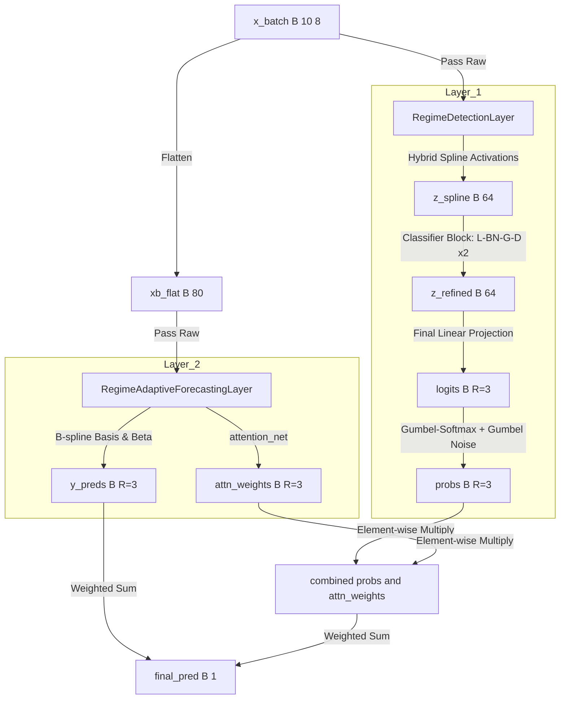

Viewed 1.py:1-446
Viewed regime_detection_layer.py:1-372

In the script [1.py](file:///Users/prana/Desktop/black_box/kas/1.py), the data flow follows a regime-switching quantitative forecasting architecture. It processes historical SPY data using a two-layer model defined in [regime_detection_layer.py](file:///Users/prana/Desktop/black_box/kas/regime_detection_layer.py): **Layer 1** ([RegimeDetectionLayer](file:///Users/prana/Desktop/black_box/kas/regime_detection_layer.py#L152)) determines the current market regime, and **Layer 2** ([RegimeAdaptiveForecastingLayer](file:///Users/prana/Desktop/black_box/kas/regime_detection_layer.py#L248)) generates regime-specific return forecasts.

---

### 1. Data Loading & Preprocessing
* **Source numpy files**: Training (`spy_train_X.npy`, `spy_train_y.npy`), validation (`spy_val_X.npy`, `spy_val_y.npy`), and testing (`spy_test_X.npy`, `spy_test_y.npy`) datasets are loaded.
* **Dimensionality**:
  * Input features ($X$): Shape of `(Batch, Time, Features)` where the total flattened feature dimension is $D = \text{Time} \times \text{Features} = 10 \times 8 = 80$.
  * Target ($y$): Shape of `(Batch,)` representing the next-day returns.
* **Standardization**:
  * `X_scaler` (`StandardScaler`) is fitted on the flattened training features and normalizes all input datasets to standard normal distributions.
  * `y_scaler` (`StandardScaler`) standardizes the targets to stabilize model training.
* **PyTorch Dataloader**: Scaled tensors are packaged into `TensorDataset` and fed through `DataLoader` in batches (e.g., batch size 32 for training, 64 for evaluation).

---

### 2. Initialization & Knot Fitting
Before training starts, both layers set up coordinate boundaries for their splines:
* [fit_knots](file:///Users/prana/Desktop/black_box/kas/regime_detection_layer.py#L62) is called on both [RegimeDetectionLayer](file:///Users/prana/Desktop/black_box/kas/regime_detection_layer.py#L152) and [RegimeAdaptiveForecastingLayer](file:///Users/prana/Desktop/black_box/kas/regime_detection_layer.py#L248) using the training dataset.
* It calculates the 1% and 99% quantiles for each of the 80 flattened features, saving them in `self.x_min` and `self.x_max` buffers to perform min-max normalization mapping inputs to $[0, 1]$.

---

### 3. Step-by-Step Forward Pass Flow
For each input batch `x_batch` (shape `(B, 10, 8)`):

#### Step A: Layer 1 (Regime Detection)
1. **Gumbel Noise Perturbation** (during training): To encourage exploration, Gumbel noise $g$ of shape `(num_regimes, B, 10, 8)` is generated. For each regime path $r \in \{0, 1, 2\}$, a noisy version of the inputs is created: $\phi_{\text{noisy}, r} = x\_batch + 0.1 \times g[r]$.
2. **Spline Activation**: The noisy inputs are flattened to shape `(B, 80)`, normalized to $[0, 1]$, and passed to [SplineActivation](file:///Users/prana/Desktop/black_box/kas/regime_detection_layer.py#L21).
   * **Linear Spline**: Uses $N_{\text{linear}}=3$ hat functions parameterized by `self.w` (shape `(80, 64, 3)`).
   * **Cubic Spline**: Uses $N_{\text{cubic}}=2$ cubic terms weighted by `self.v` (shape `(80, 64, 2)`).
   * Combines them to form output embedding $z_r$ (shape `(B, 64)`).
3. **Refinement & Projection**:
   * $z_r$ goes through a classifier block (`Linear -> BN -> GELU -> Dropout` $\times$ 2) to produce `z_refined_r` (shape `(B, 64)`).
   * Projecting `z_refined_r` outputs logits for each regime.
4. **Softmax Routing**:
   * During training, Gumbel-Softmax with temperature `tau` and `hard=True` (Straight-Through Estimator) routes samples as one-hot indicators `probs` (shape `(B, 3)`).
   * The returned embedding `z` is the average embedding across noisy regime paths (shape `(B, 64)`).

#### Step B: Layer 2 (Regime-Adaptive Forecasting)
1. **Input**: The raw input batch `x_batch` is flattened to `xb_flat` (shape `(B, 80)`).
2. **B-Spline Splitting**:
   * Normalized features are transformed into $N_{\text{basis}}=5$ B-spline basis functions (shape `(B, 80, 5)`).
   * For each of the 3 regimes, a prediction is computed using regime-specific parameters:
     $$\text{y\_pred}_r = \sum_{\text{features}} \phi_j^{(r)} \cdot w_j^{(r)}$$
     where $\phi$ is the spline mapping of features computed using coefficients `self.beta[r]`, and $w$ represents `self.forecast_weights[r]`.
   * This yields `y_preds` (shape `(B, 3)`).
3. **Attention Weighting**: `xb_flat` passes through a linear layer (`self.attention_net`) followed by a softmax to generate sample-wise regime attention weights `attn_weights` (shape `(B, 3)`).

#### Step C: Weighted Forecast Aggregation
1. The regime probability `probs` and attention weights `attn_weights` are combined:
   $$\text{combined} = \text{probs} \odot \text{attn\_weights}$$
2. After normalizing `combined` to sum to 1 across regimes, the final prediction is computed via a weighted sum over the regime-specific predictions:
   $$\text{final\_pred} = \sum_{r} \text{combined}_r \cdot \text{y\_pred}_r$$

---

### 4. Loss & Backpropagation
During backpropagation:
* **Huber Loss**: Compares `final_pred` directly against normalized target return `y_batch`.
* **Contrastive Loss**: Maximizes the feature-space separation between distinct regimes.
* **Orthogonality Loss**: Ensures regime weights remain linearly independent.
* **Balance Loss**: Penalizes regime usage collapse.
* **L1 Regularization**: Enforces parameter sparsity on KAN splines.

---

### 5. Evaluation & De-scaling
* During testing/validation, `final_pred_t` is generated.
* **De-standardization**: The predicted values are scaled back to the original financial return space using:
  $$\text{pred\_unscaled} = \text{y\_scaler.inverse\_transform}(\text{final\_pred\_t})$$
* **Trading Return Calculation**: Trading signals are derived by taking the sign of the prediction, and the realized returns are computed:
  $$\text{returns} = \text{sign}(\text{pred\_unscaled}) \times y\_test$$
  This yields the strategy performance metrics (Sharpe Ratio, Win Rate, Drawdowns).